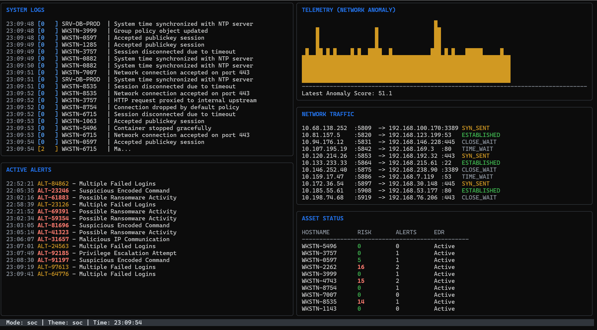

# VeryBusy

> A terminal-based Security Operations Center (SOC) dashboard simulator written in Go.

VeryBusy is a TUI (Text User Interface) application built with [Charm's Bubble Tea](https://github.com/charmbracelet/bubbletea) and [Lip Gloss](https://github.com/charmbracelet/lipgloss). It simulates a realistic SOC environment by generating plausible, randomized security alerts, streaming system logs, network traffic, asset health, and simulated telemetry metrics.



Perfect for background use while screen sharing, creating hacker-movie vibes, or demonstrating terminal multiplexer workflows.

## Features

- **Realistic Simulation**: Plausible log messages, alerts (e.g., Ransomware activity, Encoded PowerShell), and network traffic.
- **Multiple Modes**: Launch specific screens individually or an intricate multi-panel dashboard.
- **Randomized Pacing**: Updates happen realistically—log streams burst unpredictably while metric dashboards update steadily.
- **Terminal Native**: Operates entirely within your terminal, utilizing rich text styling and responsive layout resizing.

## Installation

```bash
go install github.com/yuunaka1/VeryBusy/cmd/verybusy@latest
```
*(Alternatively, clone the repository and build via `go build -o verybusy ./cmd/verybusy`)*

## Usage

Run the `soc` mode for a full 5-panel dashboard:
```bash
verybusy soc
```

### Display Modes

| Command | Description |
|---|---|
| `verybusy soc` | Full dashboard view with 5 split screens (Left 2, Right 3, excluding Telemetry). |
| `verybusy logs` | Live stream of system, application, and security logs. |
| `verybusy alerts` | Active incident tracking and detection alerts. |
| `verybusy network` | Mock real-time network traffic connections (src/dst/ports). |
| `verybusy graphs` | Telemetry graph view (Anomaly scores, etc.). |
| `verybusy assets` | Endpoint status, showing risk scores and EDR agent states. |
| `verybusy hex` | Real-time scrolling hexdump of a suspicious PE executable in analysis. |

### Global Flags

- `--theme` (`-t`): Set the simulation scenario (e.g., `soc`, `cloud`, `endpoint`). Default is `soc`.
- `--seed` (`-s`): Simulation random seed. Use `0` for true randomness (default).

## Tech Stack
- [Bubble Tea](https://github.com/charmbracelet/bubbletea) - The fun, functional, and stateful way to build terminal apps.
- [Lip Gloss](https://github.com/charmbracelet/lipgloss) - Style definitions for nice terminal layouts.
- [Cobra](https://github.com/spf13/cobra) - CLI framework.
